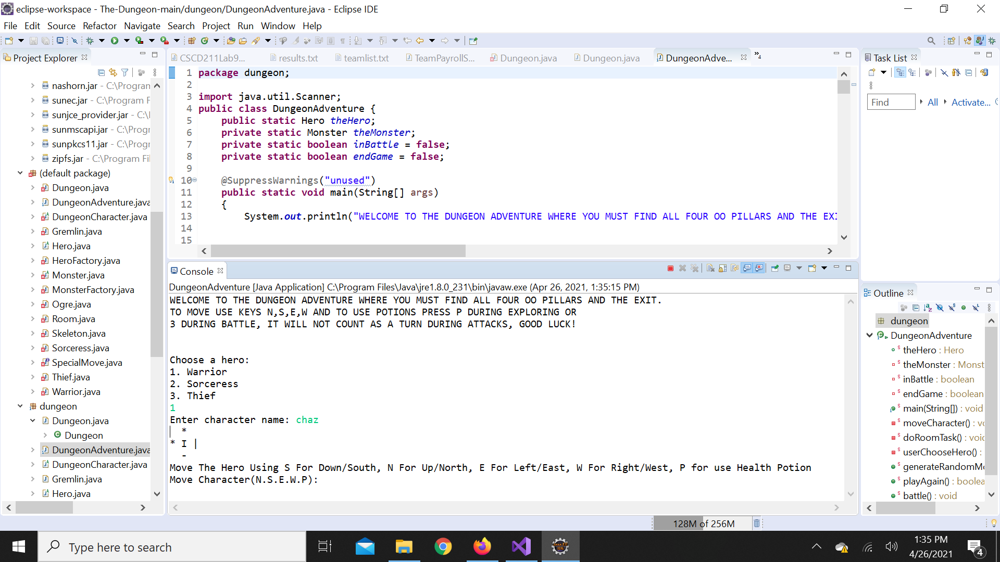

# The-Dungeon
A game where you traverse a 'maze' from one end to the other. Can you make it through without dying?
 
>>>> This game shows off the 4 pillars of OOP. 
 
 
TO START:
 
1. Download and extract the Zip File  
2. Open Eclipse or IntelliJ and open the "The-Dungeon-Main" folder in the IDE 
3. If your set up process is like mine, create a package that is named "dungeon" (or simply rename the default package to dungeon). Transfer the compilable files (Java classes with SOLID fill J) to the dungeon package. 
4. Run the DungeonAdventure.Java class. (proceed with errors) 
5. Play the game! :D 
 
 
"WELCOME TO THE DUNGEON ADVENTURE WHERE YOU MUST FIND ALL FOUR OO PILLARS AND THE EXIT. 
TO MOVE USE KEYS N,S,E,W AND TO USE POTIONS PRESS P DURING EXPLORING OR  
3 DURING BATTLE, IT WILL NOT COUNT AS A TURN DURING ATTACKS, GOOD LUCK!" 
  

 
